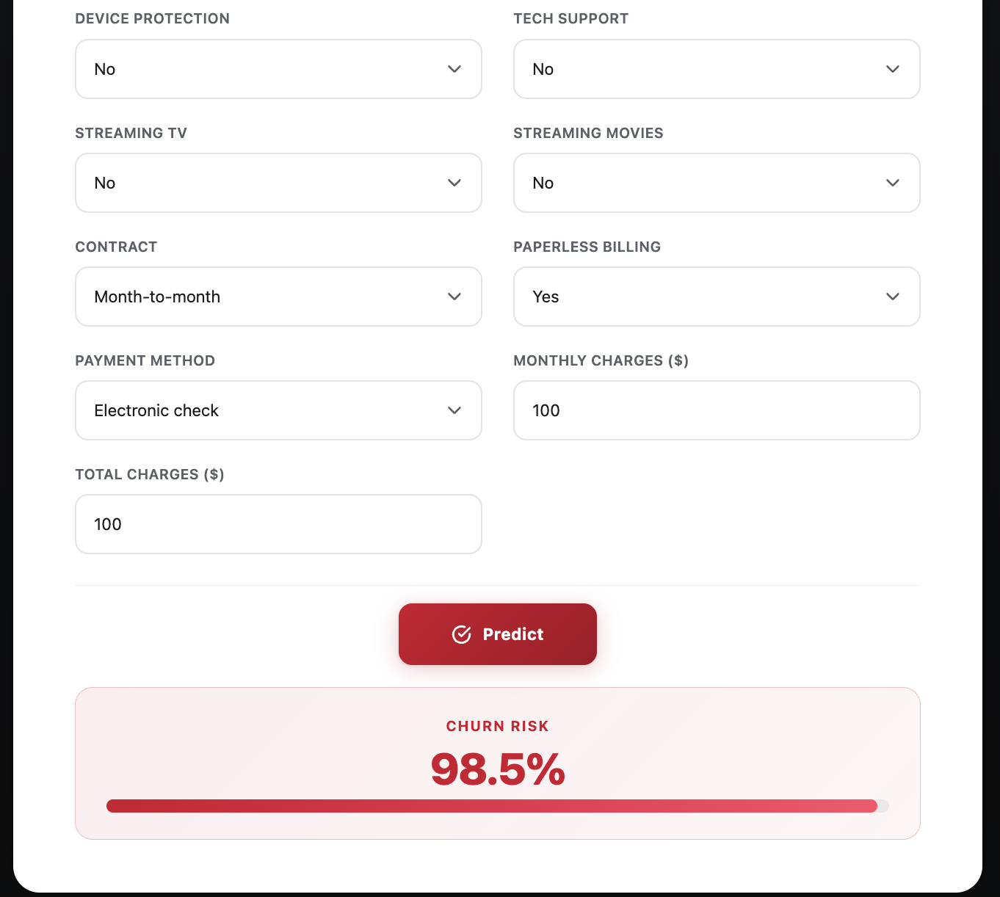
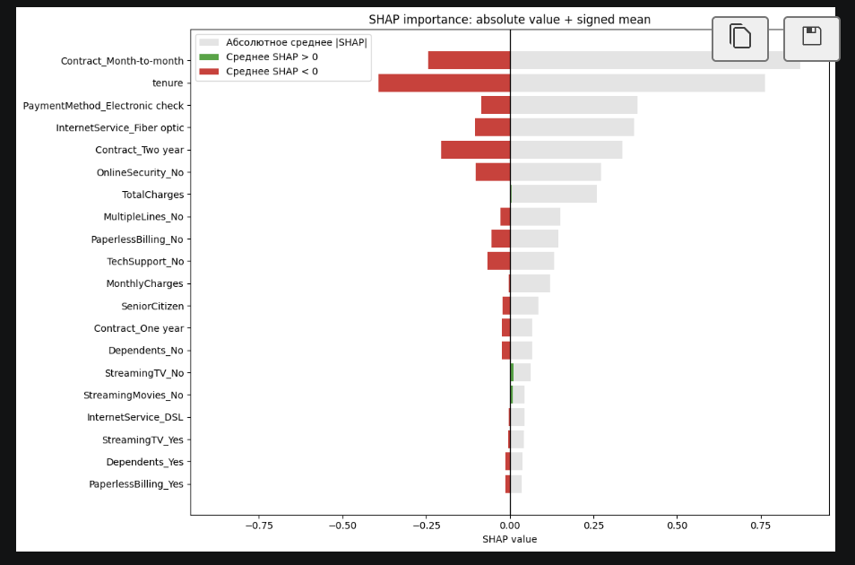
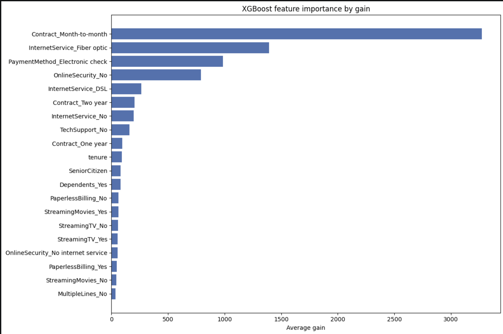

# Customer Churn Prediction

Пет-проект: пайплайн от EDA и обучения моделей в Jupyter до продакшн-сервиса на FastAPI с фронтендом и Docker-деплоем.

## Технологии

**ML:** XGBoost, CatBoost, LightGBM, RandomForest, LogisticRegression, Stacking (LogReg + LightGBM мета-модели), SHAP для интерпретации, Optuna для подбора гиперпараметров, Stratified K-Fold кросс-валидация.

**Backend:** FastAPI, Uvicorn, Pydantic.

**Frontend:** React 19, Vite.

**Инфраструктура:** Docker, Docker Compose.

## Запуск

```bash
cd model-api
docker compose up --build
```

- Frontend: http://localhost:5173
- Backend API: http://localhost:8000/docs

## Скриншоты

<table align="center">
  <tr>
    <td align="center"></td>
    <td align="center"></td>
    <td align="center"></td>
  </tr>
</table>

## Структура проекта

```
├── analyze.ipynb                  # Полный пайплайн: EDA, модели, стекинг, SHAP
├── src/                           # train.py, predict.py, data.py
├── model-api/
│   ├── docker-compose.yml         # Сборка backend + frontend
│   ├── backend/
│   │   ├── app/                   # FastAPI: main.py, model.py, schemas.py
│   │   └── models/                # Обученные модели для API
│   └── frontend/
│       ├── Dockerfile
│       ├── src/                   # React-компоненты
│       └── package.json
├── data/
│   ├── train.csv
│   └── test.csv
└── saved models/                  # Обученные модели (.joblib, .cbm)
```

## CLI

```bash
# Обучение
python scripts/main.py --mode train --model XGBClassifier

# Предсказание
python scripts/main.py --mode predict --model-path "saved models/xgboost.joblib"
```

Доступные модели: `XGBClassifier`, `CatBoostClassifier`, `LightGBM`, `RandomForestClassifier`, `LogisticRegression`
